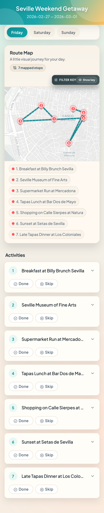

# Interactive Trip Itinerary

A mobile-first, static web app for browsing a multi-day itinerary with maps, checklists, and rich activity details.

## Screenshot Tour

### Day view + route map



## What It Does

- Day-by-day tabs with keyboard-accessible navigation
- Visual route map with numbered stops and map links
- Per-activity checklist with done/skip state
- Expandable details with image, notes, ratings, and website
- JSON itinerary loading with schema and semantic validation
- Graceful empty-day support

## Run Locally

1. Install dependencies:

```bash
npm install
```

2. Start a local server:

```bash
npx serve -l 3000 -s .
```

3. Open:

```text
http://localhost:3000
```

Use HTTP static hosting (local server, GitHub Pages, Netlify, etc.). Do not use `file://` URLs.

## Load Your Own Itinerary

Use **Load Itinerary** in the app and select a JSON file that matches the schema:

- [Schema: itinerary-file.schema.json](specs/001-interactive-itinerary/contracts/itinerary-file.schema.json)
- [Example: valid-itinerary.json](tests/fixtures/valid-itinerary.json)
- [Example: seville-itinerary.json](seville-itinerary.json)

## Testing

```bash
npm run test:unit
npm run test:integration
npm run test:e2e
npm run test
```

## Deploy Cloudflare Worker

Deploy `cloudflare/worker.js` with:

```bash
npm run deploy:worker -- <worker-name> [environment]
```

Example:

```bash
npm run deploy:worker -- interactive-itinerary-worker production
```

Prerequisites:

- Run `npx wrangler login` once
- Configure required Worker bindings/secrets (for example `ITINERARY_KV`, `ITINERARY_PASSWORD`)
- Place your real itinerary in git-ignored path `private/local-itineraries/seville-itinerary.private.json`
- Deploy script seeds remote KV key `active-itinerary` from that private path by default
- Override seed file with `ITINERARY_SOURCE_PATH=/absolute/path/to/private-itinerary.json npm run deploy:worker -- <worker-name>`

## Enforce Worker Deploy Before Push

Install repo git hooks once:

```bash
npm run setup:hooks
```

After setup, pushes are blocked if `cloudflare/worker.js` does not match the last successful deploy stamp.

## Tech Notes

- App uses static multi-file layout: `index.html` + `assets/styles/app.css` + `assets/scripts/app.js`
- Default itinerary seed data is stored in `assets/data/default-itinerary.json`
- Paths are relative (no root-absolute URLs), so deployment is safe under subpaths (for example GitHub Pages project sites)
- No build step required for runtime
- End-to-end coverage includes mobile viewports via Playwright

## License

Private project.
